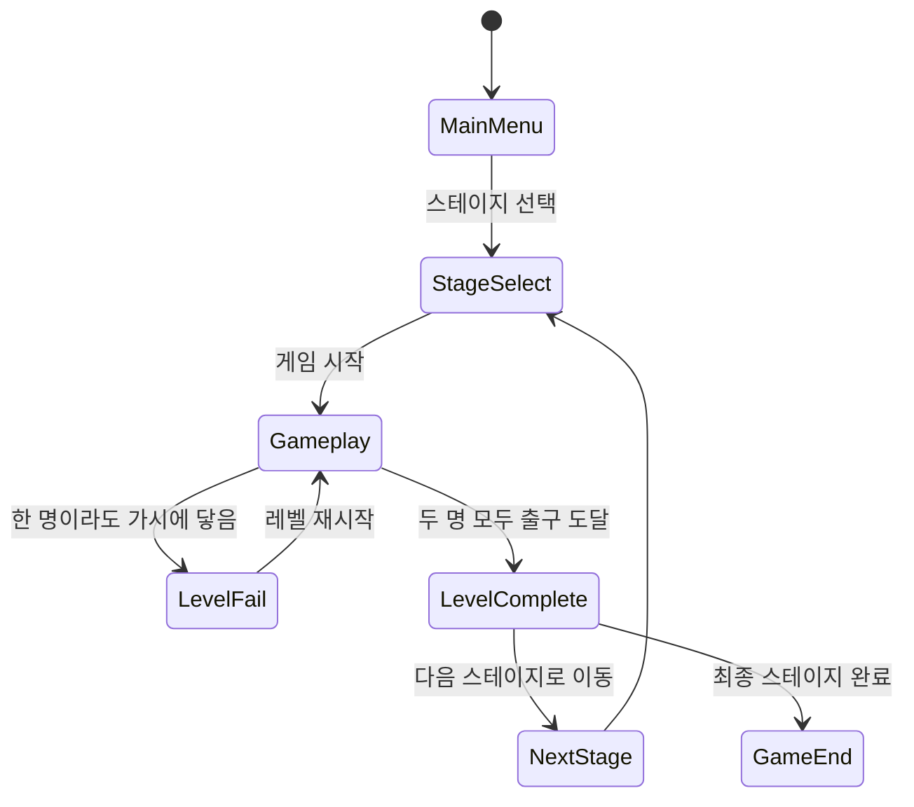
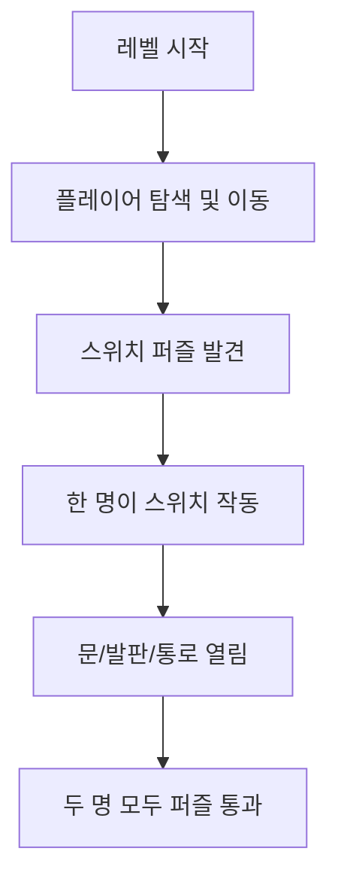

# 🎮 Climb Together - 게임 기획서

## 개요

- **제목**: Climb Together
- **장르**: 2D 협동 플랫포머
- **플레이 인원**: 2인 협동
- **플랫폼**: PC (키보드 전용)
- **플레이 시간**: 약 10분
- **그래픽 스타일**: 픽셀 아트
- **엔진**: (미정)

## 스토리

두 플레이어는 거대한 산을 협력하여 올라야 합니다. 장애물과 함정을 피하고, 서로의 실력을 조합해 협동 퍼즐을 해결하면서 정상에 도달하는 것이 목표입니다.

---

## 게임 시스템

### 조작 방식

| 동작         | 키보드 입력          |
|--------------|-----------------|
| 이동         | ← / →           |
| 점프         | X               |
| 벽 점프      | 벽 접촉 + 점프       |
| 대시         | C               |
| 벽 슬라이딩  | 벽 접촉 + 벽 방향 이동 입력 |

### 기본 능력

- 모든 플레이어는 동일한 능력을 가짐
- 캐릭터끼리 충돌 없음 (관통 가능)
- 두 명 모두 출구에 도달해야 레벨 클리어

### 협동 메커니즘

- **스위치 퍼즐**: 한 명이 스위치를 밟으면, 문/플랫폼/통로가 잠시 열림
- **클리어 조건**: 두 명 모두 도달 시에만 다음 스테이지 진행
- **카메라 시스템**: 한 명이 먼저 도달하면 클리어하지 못한 쪽을 따라감

### 추가 가능 기능 (계획 중)

- **로프 액션**: 일정 거리 이상 떨어지면 로프가 연결되어 강제 협동
- **끌어주기**: 한 플레이어가 다른 플레이어를 잡아 끌어올릴 수 있음

---

## 레벨 디자인

- **총 스테이지 수**: 5 ~ 10개
- **입구 위치**: 항상 좌측 하단
- **출구 위치**: 항상 우측 상단
- **난이도 구조**:
    1. 이동 튜토리얼
    2. 점프/대시 활용
    3. 벽 점프 구간
    4. 협동 스위치 활용
    5. 정밀 점프 + 협동 종합
- **게임 종료 조건**: 최종 스테이지 클리어 → 정상 도달 (엔딩)

---

## 아트/사운드

- **그래픽**: 픽셀 아트 기반 간결한 스타일
- **배경**: 산, 절벽, 구름, 설산 등 자연 요소 중심
- **사운드**: 감성적이고 몰입감 있는 BGM + 조작 효과음

---

## 게임 상태 흐름도 (State Diagram)



---

## 플레이어 협동 퍼즐 Flowchart



---

## 시퀀스 다이어그램

```mermaid
sequenceDiagram
    participant P1 as Player 1
    participant P2 as Player 2
    participant Game as Game System

    P1->>Game: 이동/점프/벽점프/대시
    P2->>Game: 이동/점프/벽점프/대시

    P1->>Game: 스위치 작동
    Game-->>P2: 문/발판 열림

    P2->>Game: 퍼즐 통과
    P1->>Game: 퍼즐 통과

    Note over P1, P2: 로프/끌어주기 기능 (추가 가능)

    P1->>Game: 출구 도달
    P2->>Game: 출구 도달

    Game-->>All: 다음 스테이지 이동
